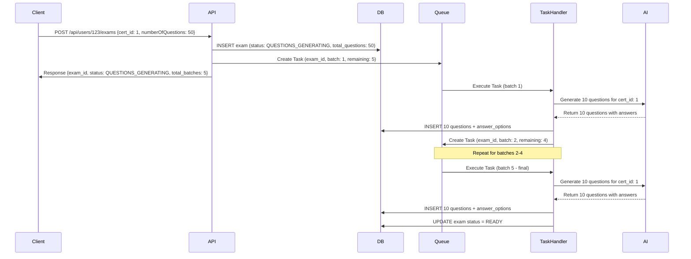
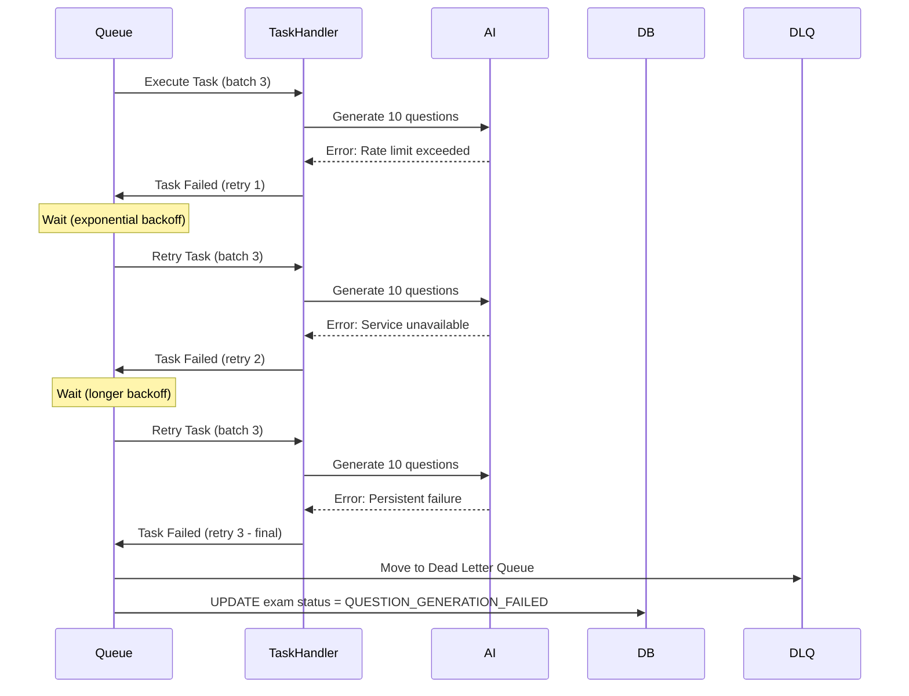
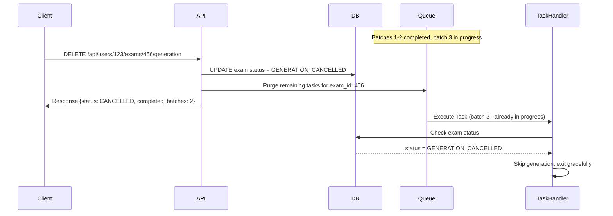

# Exam Question Generation with Cloud Tasks

This implementation uses Google Cloud Tasks to recursively generate exam questions in batches.

## How it works

### System Architecture Overview

```
┌─────────────────┐    ┌─────────────────┐    ┌─────────────────┐
│   Client App    │    │  Cloud Function │    │  Cloud Tasks    │
│                 │    │     (API)       │    │     Queue       │
└─────────────────┘    └─────────────────┘    └─────────────────┘
         │                       │                       │
         │ POST /api/users/      │                       │
         │ {user_id}/exams       │                       │
         │──────────────────────►│                       │
         │                       │ Create Initial Task   │
         │                       │──────────────────────►│
         │                       │                       │
         │ Response: GENERATING  │                       │
         │◄──────────────────────│                       │
         │                       │                       │
                                 │                       │
                    ┌─────────────────────────────────────┘
                    │
                    ▼
         ┌─────────────────┐    ┌─────────────────┐    ┌─────────────────┐
         │ Task Handler    │    │   AI Service    │    │    Database     │
         │ /delegators/    │    │  (Quiz Gen)     │    │   (Prisma)      │
         │ tasks/take      │    │                 │    │                 │
         └─────────────────┘    └─────────────────┘    └─────────────────┘
```

### Detailed Workflow

#### 1. **Exam Creation Flow**

When a user creates an exam via `POST /api/users/{user_id}/exams`:

**Function Call Sequence:**

```
Client Request
    ↓
endpoints/users/exams.ts → createExam()
    ↓
services/examService.ts → createExamWithAsyncGeneration()
    ↓
├── Database: Create exam record (status: QUESTIONS_GENERATING)
├── Calculate batches: Math.ceil(numberOfQuestions / QUESTIONS_PER_BATCH)
└── Cloud Tasks: Create first task
    ↓
utils/cloudTasks.ts → createExamGenerationTask()
    ↓
Google Cloud Tasks Queue → exam-questions-queue
```

#### 2. **Recursive Generation Flow**

The task handler at `/delegators/tasks/take` processes each batch:

**Function Call Sequence:**

```
Cloud Tasks Queue
    ↓
delegators/tasks/take.ts → handleExamGeneration()
    ↓
services/quizGenerator.ts → generateBatchQuestions()
    ↓
├── AI Service: Generate questions for batch
├── Database: Store questions and answer options
└── Decision: More batches needed?
    ├── YES → Create next Cloud Task (recursive)
    └── NO → Update exam status to READY
```

#### 3. **Error Handling Flow**

If any step fails:

**Function Call Sequence:**

```
Any Function Error
    ↓
services/examService.ts → updateExamStatus()
    ↓
Database: Update status to QUESTION_GENERATION_FAILED
    ↓
Optional: Dead Letter Queue handling
```

### Scenarios and Call Flows

#### Scenario 1: Successful 50-Question Exam Generation



#### Scenario 2: Error Handling with Retry



#### Scenario 3: User Cancellation Mid-Generation



### Function Call Map

#### Core Functions and Their Responsibilities

```
📁 endpoints/users/exams.ts
├── createExam() - Main entry point for exam creation
├── getExamStatus() - Check generation progress
├── cancelExamGeneration() - Cancel in-progress generation
└── rollbackExam() - Rollback completed exam

📁 services/examService.ts
├── createExamWithAsyncGeneration() - Orchestrates exam creation
├── updateExamStatus() - Updates exam status in database
├── calculateBatches() - Determines number of batches needed
├── validateExamRequest() - Validates incoming exam parameters
└── handleExamCancellation() - Processes cancellation requests

📁 services/quizGenerator.ts
├── generateBatchQuestions() - Generates questions for a batch
├── validateQuestionQuality() - Checks generated question quality
├── formatQuestionsForDB() - Prepares questions for database storage
└── handleGenerationError() - Processes AI service errors

📁 delegators/tasks/take.ts
├── handleExamGeneration() - Main task handler entry point
├── processNextBatch() - Processes individual batches
├── createNextTask() - Creates subsequent Cloud Tasks
├── handleTaskError() - Processes task failures
└── finalizeExam() - Completes exam when all batches done

📁 utils/cloudTasks.ts
├── createExamGenerationTask() - Creates Cloud Tasks
├── purgeExamTasks() - Removes pending tasks (for cancellation)
├── configureTaskRetry() - Sets retry policies
└── generateTaskId() - Creates unique task identifiers

📁 utils/database.ts
├── storeQuestions() - Saves questions to database
├── checkExamStatus() - Retrieves current exam status
├── getBatchProgress() - Gets completion status of batches
└── rollbackQuestions() - Removes questions during rollback
```

### State Machine Diagram

```
                    ┌─────────────────┐
                    │    CREATED      │
                    └─────────┬───────┘
                              │ createExam()
                              ▼
                    ┌─────────────────┐
                    │QUESTIONS_       │◄──── Task Retry
                    │GENERATING       │      (on failure)
                    └─────────┬───────┘
                              │
                    ┌─────────▼───────┐
                    │   Processing    │
                    │   Batches       │
                    └─────────┬───────┘
                              │
              ┌───────────────┼───────────────┐
              │               │               │
              ▼               ▼               ▼
    ┌─────────────┐ ┌─────────────┐ ┌─────────────┐
    │   READY     │ │ GENERATION_ │ │QUESTION_    │
    │             │ │ CANCELLED   │ │GENERATION_  │
    │             │ │             │ │FAILED       │
    └─────────────┘ └─────────────┘ └─────────────┘
            │               │               │
            │               │               │
            ▼               ▼               ▼
    ┌─────────────┐ ┌─────────────┐ ┌─────────────┐
    │ ROLLBACK_   │ │ ROLLBACK_   │ │ ROLLBACK_   │
    │ COMPLETED   │ │ COMPLETED   │ │ COMPLETED   │
    └─────────────┘ └─────────────┘ └─────────────┘
```

### Monitoring and Debugging Flow

#### Function Call Tracing

```javascript
// Example: Tracing a complete exam generation
console.log("TRACE_START", {
  timestamp: new Date().toISOString(),
  exam_id: "exam-123",
  user_id: "user-456",
  cert_id: 1,
  total_questions: 50,
});

// In createExam()
console.log("TRACE_EXAM_CREATED", {
  exam_id: "exam-123",
  status: "QUESTIONS_GENERATING",
  total_batches: 5,
});

// In handleExamGeneration()
console.log("TRACE_BATCH_START", {
  exam_id: "exam-123",
  batch_number: 1,
  questions_to_generate: 10,
});

// In generateBatchQuestions()
console.log("TRACE_AI_REQUEST", {
  exam_id: "exam-123",
  batch_number: 1,
  ai_service: "openai",
  prompt_tokens: 150,
});

// In storeQuestions()
console.log("TRACE_DB_STORE", {
  exam_id: "exam-123",
  batch_number: 1,
  questions_stored: 10,
  answers_stored: 40,
});

// In createNextTask()
console.log("TRACE_NEXT_TASK", {
  exam_id: "exam-123",
  next_batch: 2,
  remaining_batches: 4,
  task_id: "exam-123-batch-2-1234567890",
});
```

## Configuration

- **Questions per batch**: 10 (configurable via `QUESTIONS_PER_BATCH` constant)
- **Queue name**: `exam-questions-queue`
- **Queue rate**: 10 tasks/second
- **Retry policy**: Up to 3 retries with exponential backoff

## Deployment

1. Deploy the queue:

   ```bash
   ./scripts/deploy-queues.sh
   ```

2. Deploy your Cloud Functions with the updated code

## API Usage

```javascript
// Create an exam with 50 questions
POST /api/users/{user_id}/exams
{
  "cert_id": 1,
  "numberOfQuestions": 50
}

// Response
{
  "success": true,
  "message": "Exam creation initiated. Questions are being generated asynchronously.",
  "data": {
    "exam_id": "uuid",
    "user_id": "uuid",
    "cert_id": 1,
    "status": "QUESTIONS_GENERATING",
    "total_questions": 50,
    "total_batches": 5
  }
}
```

The exam will be processed in 5 batches of 10 questions each. The client can poll the exam status to check when it's ready.

## Performance Characteristics

### Timing Expectations

```
Exam Size    | Batches | Est. Time | API Response | First Questions Ready
-------------|---------|-----------|--------------|---------------------
10 questions | 1       | 30-60s    | <200ms      | 30-60s
25 questions | 3       | 1-3 min   | <200ms      | 30-60s
50 questions | 5       | 3-5 min   | <200ms      | 30-60s
100 questions| 10      | 5-10 min  | <200ms      | 30-60s
200 questions| 20      | 10-20 min | <200ms      | 30-60s
```

### Resource Usage Patterns

#### Memory Usage per Batch

```
├── AI Request Processing: ~50MB
├── Question Data Storage: ~10MB
├── Database Operations: ~5MB
└── Task Overhead: ~2MB
Total per batch: ~67MB
```

#### API Call Patterns

```
1 Exam Creation → 1 Database Write + 1 Cloud Task Creation
1 Batch Process → 1 AI API Call + 10 Database Writes + 0-1 Cloud Task Creation
1 Status Check → 1 Database Read
```

### Concurrent Processing Limits

```
Queue Configuration:
├── Max concurrent tasks: 10
├── Rate limit: 10 tasks/second
├── Max AI API calls: 100/minute
└── Database connections: 50
```

## Benefits

- **Scalable**: Can handle large numbers of questions without timeouts
- **Resilient**: Built-in retry mechanisms for failed tasks
- **Non-blocking**: API responds immediately while processing happens asynchronously
- **Configurable**: Easy to adjust batch sizes and queue settings

## Potential Improvements for Reliability

### 1. Enhanced Error Tolerance

#### Dead Letter Queue (DLQ)

```yaml
# queue.yaml enhancement
queue:
  - name: exam-questions-queue
    rate: 10/s
    retry_parameters:
      task_retry_limit: 3
      min_backoff_seconds: 60
      max_backoff_seconds: 3600
      max_doublings: 3
    dead_letter_policy:
      max_delivery_attempts: 5
      dead_letter_queue: exam-questions-dlq
```

#### Graceful Error Recovery

- **Partial Success Handling**: Track completed batches to avoid regenerating successful ones
- **Circuit Breaker Pattern**: Temporarily halt generation if AI service is consistently failing
- **Exponential Backoff**: Implement custom backoff strategies for different error types
- **Error Classification**: Distinguish between retryable (network timeouts) and non-retryable errors (invalid certification)

### 2. Idempotency Improvements

#### Task Deduplication

```javascript
// Example: Add unique task IDs based on exam_id + batch_number
const taskId = `exam-${exam_id}-batch-${batch_number}-${timestamp}`;
```

#### Database State Checks

- **Batch Status Tracking**: Store individual batch completion status
- **Question Existence Validation**: Check if questions already exist before generation
- **Atomic Operations**: Use database transactions for multi-step operations

#### Duplicate Prevention

```sql
-- Example: Add unique constraints to prevent duplicate questions
ALTER TABLE exam_questions
ADD CONSTRAINT unique_exam_question
UNIQUE (exam_id, question_order);
```

### 3. Enhanced Monitoring and Observability

#### Comprehensive Logging

```javascript
// Example: Structured logging for better observability
console.log(
  JSON.stringify({
    level: "INFO",
    event: "batch_generation_started",
    exam_id,
    batch_number,
    questions_count,
    timestamp: new Date().toISOString(),
  })
);
```

#### Metrics and Alerts

- **Success Rate Monitoring**: Track percentage of successful generations
- **Queue Depth Alerts**: Monitor queue backlog to detect bottlenecks
- **Generation Time Metrics**: Track average time per batch/question
- **Error Rate Thresholds**: Alert when error rates exceed acceptable limits

#### Health Checks

- **Exam Status Endpoint**: `GET /api/exams/{exam_id}/status` with detailed progress
- **Queue Health**: Monitor queue processing rates and failures
- **AI Service Health**: Regular health checks on question generation service

### 4. Performance Optimizations

#### Intelligent Batching

- **Dynamic Batch Sizing**: Adjust batch size based on certification complexity
- **Parallel Processing**: Generate multiple batches concurrently when possible
- **Resource-Based Scaling**: Scale batch size based on available AI quota

#### Caching Strategies

- **Question Templates**: Cache common question patterns for faster generation
- **Certification Context**: Cache certification details to avoid repeated lookups
- **AI Response Caching**: Cache similar questions to reduce AI API calls

## Rollback Strategies

### 1. Immediate Rollback (During Generation)

#### Cancel In-Progress Generation

```javascript
// API endpoint to cancel exam generation
DELETE /api/users/{user_id}/exams/{exam_id}/generation
{
  "reason": "user_cancelled",
  "preserve_completed_batches": true
}
```

#### Implementation Steps

1. **Mark Exam as Cancelled**: Update exam status to `GENERATION_CANCELLED`
2. **Purge Remaining Tasks**: Remove pending Cloud Tasks from the queue
3. **Cleanup Partial Data**: Option to keep or remove partially generated questions
4. **Refund Credits**: If applicable, refund used question generation credits

### 2. Post-Generation Rollback

#### Complete Exam Removal

```javascript
// Rollback completed exam
POST /api/users/{user_id}/exams/{exam_id}/rollback
{
  "rollback_type": "complete_removal",
  "reason": "quality_issues"
}
```

#### Selective Question Removal

```javascript
// Remove specific questions/batches
POST /api/users/{user_id}/exams/{exam_id}/rollback
{
  "rollback_type": "selective",
  "batch_numbers": [3, 4, 5],
  "regenerate": true
}
```

### 3. Database Rollback Procedures

#### Transaction-Based Rollback

```sql
-- Example: Rollback entire exam generation
BEGIN TRANSACTION;

-- Store rollback information for audit
INSERT INTO exam_rollbacks (exam_id, rollback_reason, rollback_timestamp)
VALUES (?, ?, NOW());

-- Remove exam questions and answers
DELETE FROM answer_options WHERE question_id IN
  (SELECT id FROM exam_questions WHERE exam_id = ?);
DELETE FROM exam_questions WHERE exam_id = ?;

-- Update exam status
UPDATE exams SET
  status = 'ROLLBACK_COMPLETED',
  rollback_timestamp = NOW()
WHERE id = ?;

COMMIT;
```

#### Point-in-Time Recovery

- **Database Snapshots**: Regular snapshots before major operations
- **Incremental Backups**: Continuous backup of question generation data
- **Audit Trail**: Complete log of all generation and rollback operations

### 4. Automated Rollback Triggers

#### Quality-Based Rollback

```javascript
// Automatic rollback based on quality metrics
if (averageQuestionQuality < QUALITY_THRESHOLD) {
  await initiateRollback(exam_id, "quality_below_threshold");
}
```

#### Resource-Based Rollback

- **AI Quota Exceeded**: Rollback when approaching AI service limits
- **Database Constraints**: Rollback when storage limits are reached
- **Cost Thresholds**: Rollback when generation costs exceed budget

### 5. Recovery Procedures

#### Disaster Recovery

1. **Backup Restoration**: Restore from latest clean backup
2. **Queue Reconstruction**: Rebuild Cloud Tasks queue state
3. **Status Reconciliation**: Sync exam statuses with actual database state
4. **Credit Recovery**: Restore user credits for failed generations

#### Data Integrity Checks

```sql
-- Verify exam data consistency
SELECT e.id, e.status, COUNT(eq.id) as question_count
FROM exams e
LEFT JOIN exam_questions eq ON e.id = eq.exam_id
WHERE e.status = 'READY' AND COUNT(eq.id) != e.total_questions;
```

## Implementation Priority

### High Priority

1. **Dead Letter Queue**: Implement DLQ for failed tasks
2. **Idempotency Keys**: Add unique task identifiers
3. **Basic Rollback API**: Implement exam cancellation endpoint
4. **Enhanced Logging**: Add structured logging for better debugging

### Medium Priority

1. **Circuit Breaker**: Implement AI service failure protection
2. **Monitoring Dashboard**: Create real-time generation monitoring
3. **Selective Rollback**: Implement batch-level rollback
4. **Quality Metrics**: Add automatic quality assessment

### Low Priority

1. **Advanced Caching**: Implement question template caching
2. **Predictive Scaling**: Auto-adjust batch sizes
3. **Cost Optimization**: Implement budget-based controls
4. **A/B Testing**: Test different generation strategies

## Troubleshooting Common Scenarios

### 1. Exam Stuck in QUESTIONS_GENERATING Status

**Symptoms:**

- Exam created hours ago still shows `QUESTIONS_GENERATING`
- No new questions appearing in database

**Debugging Steps:**

```bash
# Check Cloud Tasks queue status
gcloud tasks queues describe exam-questions-queue --location=us-central1

# Check for tasks in queue
gcloud tasks list --queue=exam-questions-queue --location=us-central1

# Check exam status in database
SELECT id, status, created_at, updated_at, total_questions,
       (SELECT COUNT(*) FROM exam_questions WHERE exam_id = exams.id) as current_questions
FROM exams
WHERE id = 'your-exam-id';
```

**Common Causes & Solutions:**

1. **Dead Letter Queue Full**: Tasks moved to DLQ after max retries

   ```bash
   # Check DLQ
   gcloud tasks list --queue=exam-questions-dlq --location=us-central1
   ```

2. **AI Service Rate Limiting**: Temporary service unavailability

   ```javascript
   // Check AI service health
   GET / api / health / ai - service;
   ```

3. **Database Connection Issues**: Connection pool exhausted
   ```sql
   -- Check active connections
   SELECT count(*) FROM pg_stat_activity;
   ```

### 2. Questions Generated But Poor Quality

**Symptoms:**

- Exam status shows `READY`
- Questions are nonsensical or irrelevant

**Debugging Steps:**

```sql
-- Analyze question quality metrics
SELECT
    eq.id,
    eq.question_text,
    eq.difficulty,
    eq.ai_confidence_score,
    c.name as certification_name
FROM exam_questions eq
JOIN exams e ON eq.exam_id = e.id
JOIN certifications c ON e.cert_id = c.id
WHERE e.id = 'your-exam-id'
ORDER BY eq.ai_confidence_score ASC;
```

**Function Call for Quality Check:**

```javascript
// In services/quizGenerator.ts
async function validateQuestionQuality(question, certification) {
  const qualityChecks = {
    relevance: checkCertificationRelevance(question, certification),
    difficulty: validateDifficultyLevel(question),
    clarity: assessQuestionClarity(question),
    uniqueness: checkForDuplicates(question),
  };

  console.log("QUALITY_CHECK", {
    question_id: question.id,
    checks: qualityChecks,
    overall_score: calculateOverallScore(qualityChecks),
  });

  return qualityChecks;
}
```

### 3. Memory or Timeout Issues

**Symptoms:**

- Tasks failing with memory errors
- Generation taking much longer than expected

**Debugging Function Calls:**

```javascript
// In delegators/tasks/take.ts
async function handleExamGeneration(payload) {
  const startTime = Date.now();
  const initialMemory = process.memoryUsage();

  console.log("TASK_START", {
    exam_id: payload.exam_id,
    batch_number: payload.batch_number,
    memory_usage: initialMemory,
    timestamp: new Date().toISOString(),
  });

  try {
    // ... generation logic

    const endTime = Date.now();
    const finalMemory = process.memoryUsage();

    console.log("TASK_COMPLETE", {
      exam_id: payload.exam_id,
      batch_number: payload.batch_number,
      duration_ms: endTime - startTime,
      memory_delta: {
        rss: finalMemory.rss - initialMemory.rss,
        heapUsed: finalMemory.heapUsed - initialMemory.heapUsed,
      },
    });
  } catch (error) {
    console.error("TASK_ERROR", {
      exam_id: payload.exam_id,
      batch_number: payload.batch_number,
      error: error.message,
      stack: error.stack,
      memory_at_failure: process.memoryUsage(),
    });
    throw error;
  }
}
```

### 4. Race Conditions and Duplicate Questions

**Symptoms:**

- Same questions appearing multiple times
- Exam has more questions than requested

**Prevention Function:**

```javascript
// In services/examService.ts
async function ensureBatchIdempotency(examId, batchNumber) {
  const existingBatch = await db.examBatch.findFirst({
    where: {
      exam_id: examId,
      batch_number: batchNumber,
      status: "COMPLETED",
    },
  });

  if (existingBatch) {
    console.log("BATCH_ALREADY_COMPLETED", {
      exam_id: examId,
      batch_number: batchNumber,
      completed_at: existingBatch.completed_at,
    });
    return true; // Skip this batch
  }

  return false;
}
```

### 5. Cost Overruns

**Symptoms:**

- Unexpected high AI API costs
- Budget alerts triggered

**Monitoring Function:**

```javascript
// In services/quizGenerator.ts
async function trackGenerationCosts(examId, batchNumber, aiResponse) {
  const cost = calculateAICost(aiResponse.usage);

  await db.examCosts.create({
    data: {
      exam_id: examId,
      batch_number: batchNumber,
      ai_tokens_used: aiResponse.usage.total_tokens,
      estimated_cost: cost,
      ai_provider: "openai",
      timestamp: new Date(),
    },
  });

  console.log("COST_TRACKING", {
    exam_id: examId,
    batch_number: batchNumber,
    tokens_used: aiResponse.usage.total_tokens,
    estimated_cost: cost,
    cumulative_cost: await getCumulativeCost(examId),
  });

  // Check budget threshold
  const totalCost = await getCumulativeCost(examId);
  if (totalCost > BUDGET_THRESHOLD) {
    console.warn("BUDGET_EXCEEDED", {
      exam_id: examId,
      total_cost: totalCost,
      threshold: BUDGET_THRESHOLD,
    });

    await initiateRollback(examId, "budget_exceeded");
  }
}
```

### 6. Database Deadlocks

**Symptoms:**

- Random task failures
- Database constraint violations

**Prevention Strategy:**

```javascript
// In utils/database.ts
async function storeQuestionsWithRetry(examId, questions, maxRetries = 3) {
  for (let attempt = 1; attempt <= maxRetries; attempt++) {
    try {
      await db.$transaction(async (tx) => {
        // Store questions with proper locking
        await tx.examQuestions.createMany({
          data: questions.map((q) => ({
            ...q,
            exam_id: examId,
            created_at: new Date(),
          })),
        });
      });

      console.log("DB_STORE_SUCCESS", {
        exam_id: examId,
        questions_count: questions.length,
        attempt: attempt,
      });

      return; // Success, exit retry loop
    } catch (error) {
      console.warn("DB_STORE_RETRY", {
        exam_id: examId,
        attempt: attempt,
        error: error.message,
        will_retry: attempt < maxRetries,
      });

      if (attempt === maxRetries) {
        throw error; // Final attempt failed
      }

      // Exponential backoff
      await new Promise((resolve) =>
        setTimeout(resolve, Math.pow(2, attempt) * 1000)
      );
    }
  }
}
```

### Emergency Procedures

#### Force Complete Stuck Exam

```javascript
// Emergency function to manually complete exam
async function forceCompleteExam(examId, reason) {
  console.log("FORCE_COMPLETE_START", {
    exam_id: examId,
    reason: reason,
    admin_action: true,
  });

  const questionCount = await db.examQuestions.count({
    where: { exam_id: examId },
  });

  await db.exams.update({
    where: { id: examId },
    data: {
      status: "READY",
      force_completed: true,
      force_complete_reason: reason,
      actual_questions: questionCount,
    },
  });

  // Purge any remaining tasks
  await purgeExamTasks(examId);
}
```

#### System Health Check

```javascript
// Comprehensive system health check
async function performHealthCheck() {
  const health = {
    timestamp: new Date().toISOString(),
    queue_status: await checkQueueHealth(),
    database_status: await checkDatabaseHealth(),
    ai_service_status: await checkAIServiceHealth(),
    active_generations: await getActiveGenerations(),
    error_rate: await calculateRecentErrorRate(),
  };

  console.log("SYSTEM_HEALTH", health);
  return health;
}
```
