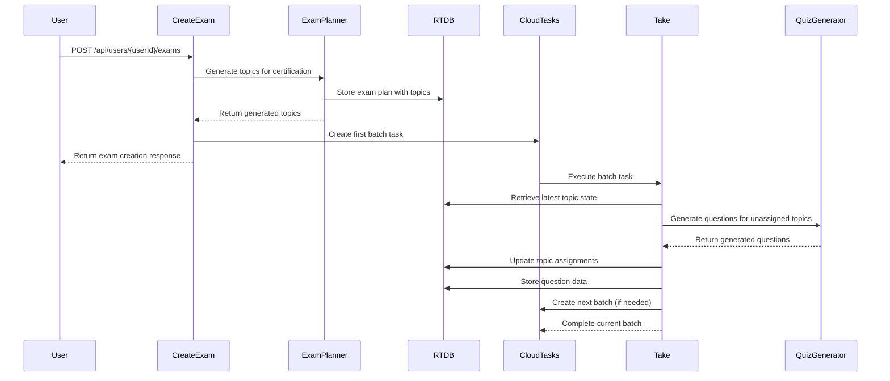

# Exam Generation System Guide

## Overview

This guide covers the certifai exam generation system that uses AI to generate certification-specific topics and questions through intelligent batch processing.

## Architecture Overview

### System Components



### Key Components

1. **ExamPlanner Service** (`services/genkit/examPlanner.ts`) - AI-powered topic generation
2. **CreateExam Handler** (`endpoints/api/users/exams/createExam.ts`) - Exam creation orchestration
3. **Take Task Handler** (`delegators/tasks/take.ts`) - Batch processing and question generation
4. **Firebase RTDB** - Real-time state management for exam plans and progress
5. **Cloud Tasks Queue** - Asynchronous batch processing
6. **Question Association Utility** (`utils/examQuestionAssociation.ts`) - Smart question selection

## Core Data Structures

### ExamTopicItem Interface

```typescript
interface ExamTopicItem {
  exam_topic: string; // AI-generated topic name
  question_id: string | null; // Associated question ID (null until generated)
}
```

### Task Payload Structure

```typescript
interface TaskPayload {
  exam_id: string;
  cert_id: number;
  certification_name: string;
  examTopicList: string; // JSON stringified ExamTopicItem[]
  batch_number: number;
  total_batches: number;
  questions_per_batch: number;
  custom_prompt_text?: string;
}
```

## How It Works

### Phase 1: Exam Creation & Topic Generation

1. **User Request**: POST `/api/users/{userId}/exams` with certification ID and question count
2. **Validation**: Check user permissions, rate limits, and certification validity
3. **AI Topic Generation**: ExamPlanner generates certification-specific topics
4. **RTDB Storage**: Store exam plan with topics (all `question_id: null` initially)
5. **Batch Calculation**: Calculate total batches based on actual topics generated
6. **Cloud Task Creation**: Schedule first batch for question generation

### Phase 2: Batch Processing

1. **Topic State Retrieval**: Get latest topic assignments from RTDB
2. **Filter Unassigned**: Process only topics without `question_id`
3. **AI Question Generation**: Generate questions for unassigned topics
4. **Database Storage**: Store questions and answer options in PostgreSQL
5. **Topic Assignment**: Update topics with generated `question_id`s
6. **RTDB Update**: Persist updated topic assignments
7. **Next Batch**: Schedule next batch if unassigned topics remain

### Phase 3: Completion

When all topics have questions assigned:

- Associate questions with exam for user access
- Update exam status to `READY`
- Clean up any temporary data

## Key Features

### Smart Batch Organization

The system now properly handles batch organization with these improvements:

1. **Accurate Batch Calculation**: Uses actual generated topics count instead of requested questions
2. **Dynamic Completion**: Stops when all topics are assigned, regardless of original batch plan
3. **Graceful Zero-Topic Handling**: Properly handles batches with no remaining work
4. **Adjusted Batch Tracking**: Recalculates remaining batches based on actual work left

### Intelligent Processing

- **No Duplicate Work**: Only processes topics that don't have questions yet
- **Resume from Failure**: Can pick up exactly where it left off after errors
- **Resource Optimization**: Avoids creating unnecessary Cloud Tasks

### Real-time State Management

- **RTDB Integration**: Exam plans stored in Firebase Realtime Database
- **Live Progress**: Frontend can track progress in real-time
- **State Consistency**: Immediate updates ensure data consistency

## Logging & Monitoring

### Key Log Events

- `EXAM_BATCH_PROCESS`: Batch processing status with topics breakdown
- `EXAM_TOPIC_STATUS`: Detailed topic assignment status
- `QUESTION_CREATED`: Individual question creation with metadata
- `TOPIC_QUESTION_ASSOCIATED`: Question-topic assignment logging
- `RTDB_UPDATE_VERIFIED`: Real-time database update verification
- `EXAM_READY`: Exam completion and status change

### Example Log Output

```json
{
  "event": "EXAM_TOPIC_STATUS",
  "exam_id": "exam-456",
  "batch_number": 1,
  "total_topics": 25,
  "assigned_topics": 5,
  "unassigned_topics": 20,
  "questions_to_generate": 20,
  "structuredData": true
}
```

## Troubleshooting & Improvement Implementation

### Current Issue Resolution

#### Immediate Actions (Working Solutions)

1. **"0 unassigned topics" error**: ✅ **Fixed** - now handles gracefully
2. **Batch doesn't complete**: Check RTDB connectivity and topic assignments
3. **Questions not associated**: Review topic name matching logic
4. **Memory issues**: Monitor batch size and processing duration

#### Enhanced Debug Process

1. Check exam status in database
2. Verify RTDB exam plan exists
3. Review batch processing logs with new structured format
4. Monitor Cloud Tasks queue status and retry patterns
5. Check question-topic associations in logs
6. **NEW**: Analyze failure patterns using improved logging

### Implementing Short-Term Improvements

#### Smart Retry Logic Implementation

```typescript
// Add to take.ts handler
const retryConfig = {
  maxRetries: 3,
  backoffMultiplier: 2,
  initialDelayMs: 1000,
  fallbackStrategies: [
    "reduced_batch_size",
    "simplified_prompts",
    "question_bank_fallback",
  ],
};

async function generateWithSmartRetry(topics: string[], attempt = 0) {
  try {
    return await quizGenerator({ examTopicList: topics });
  } catch (error) {
    if (attempt < retryConfig.maxRetries) {
      const delay =
        retryConfig.initialDelayMs *
        Math.pow(retryConfig.backoffMultiplier, attempt);
      const strategy = retryConfig.fallbackStrategies[attempt];

      logger.info(
        `Generation failed, retrying with strategy: ${strategy} after ${delay}ms`
      );
      await sleep(delay);

      return generateWithFallbackStrategy(topics, strategy, attempt + 1);
    }
    throw error;
  }
}
```

#### Enhanced Monitoring Setup

```typescript
// Add to existing logging
interface PerformanceMetrics {
  batch_start_time: number;
  ai_response_time: number;
  database_write_time: number;
  rtdb_update_time: number;
  total_batch_time: number;
  success_rate_last_10_batches: number;
}

function trackBatchPerformance(exam_id: string, metrics: PerformanceMetrics) {
  logger.info(`BATCH_PERFORMANCE: exam_id=${exam_id}`, {
    ...metrics,
    structuredData: true,
    alertThresholds: {
      total_time_warning: 300000, // 5 minutes
      success_rate_critical: 0.8, // 80%
    },
  });
}
```

#### Adaptive Batch Sizing Implementation

```typescript
// Add to createExam.ts
function calculateAdaptiveBatchSize(
  cert_id: number,
  requestedQuestions: number
): number {
  const recentMetrics = getRecentCertificationMetrics(cert_id);
  let batchSize = QUESTIONS_PER_BATCH;

  // Reduce batch size for problematic certifications
  if (recentMetrics.errorRate > 0.2) {
    batchSize = Math.max(2, Math.floor(batchSize * 0.6));
    logger.info(
      `Reduced batch size to ${batchSize} due to high error rate for cert ${cert_id}`
    );
  }

  // Consider topic complexity
  if (recentMetrics.avgProcessingTime > 180000) {
    // 3 minutes
    batchSize = Math.max(3, Math.floor(batchSize * 0.8));
    logger.info(
      `Reduced batch size to ${batchSize} due to slow processing for cert ${cert_id}`
    );
  }

  return batchSize;
}
```

### Preparing for Medium-Term Improvements

#### Multi-Provider Setup Planning

```typescript
// Configuration structure for future implementation
interface AIProviderConfig {
  name: string;
  endpoint: string;
  apiKey: string;
  priority: number; // 1 = highest
  maxConcurrency: number;
  costPerRequest: number;
  avgResponseTime: number;
  successRate: number;
}

const aiProviders: AIProviderConfig[] = [
  {
    name: "openai",
    priority: 1,
    maxConcurrency: 5,
    // ... other config
  },
  {
    name: "anthropic",
    priority: 2,
    maxConcurrency: 3,
    // ... other config
  },
];
```

#### State Management Enhancement Preparation

```typescript
// Checkpoint system design
interface ExamCheckpoint {
  exam_id: string;
  timestamp: number;
  batch_number: number;
  completed_topics: ExamTopicItem[];
  remaining_topics: ExamTopicItem[];
  error_history: ErrorRecord[];
  performance_metrics: PerformanceMetrics;
  recovery_strategy: string;
}

async function saveCheckpoint(checkpoint: ExamCheckpoint): Promise<void> {
  // Store in both RTDB and PostgreSQL for redundancy
  await Promise.all([
    updateRtdbValue(`checkpoints/${checkpoint.exam_id}`, checkpoint),
    prismaInstance.examCheckpoint.upsert({
      where: { exam_id: checkpoint.exam_id },
      update: { data: JSON.stringify(checkpoint) },
      create: { exam_id: checkpoint.exam_id, data: JSON.stringify(checkpoint) },
    }),
  ]);
}
```

### Long-Term Architecture Considerations

#### ML Integration Preparation

```typescript
// Interface for future ML integration
interface MLPredictionService {
  predictFailureProbability(context: GenerationContext): Promise<number>;
  recommendOptimalStrategy(
    context: GenerationContext
  ): Promise<GenerationStrategy>;
  updateModel(outcome: GenerationOutcome): Promise<void>;
}

// Future implementation placeholder
class ExamGenerationML implements MLPredictionService {
  async predictFailureProbability(context: GenerationContext): Promise<number> {
    // Placeholder for ML model integration
    return 0.1; // Default low probability
  }

  // ... other methods
}
```

#### Microservices Architecture Planning

```typescript
// Service separation design
interface ServiceArchitecture {
  topicGeneration: "examPlanner service";
  questionGeneration: "quizGenerator service";
  contentValidation: "qualityAssurance service";
  stateManagement: "examState service";
  monitoring: "analytics service";
}

// Future service communication via events
interface ExamEvent {
  type:
    | "topic_generated"
    | "question_created"
    | "batch_completed"
    | "exam_ready";
  exam_id: string;
  data: any;
  timestamp: number;
}
```

### Migration Strategy

#### Phase 1: Foundation (Weeks 1-4)

- Implement smart retry logic
- Enhanced monitoring and alerting
- Adaptive batch sizing

#### Phase 2: Resilience (Weeks 5-12)

- Multi-provider AI integration
- Advanced failure classification
- Content quality assurance

#### Phase 3: Intelligence (Weeks 13-24)

- ML-powered optimization
- Predictive failure prevention
- Self-healing capabilities

#### Phase 4: Scale (Weeks 25-52)

- Distributed architecture
- Edge computing
- Advanced analytics

### Monitoring Implementation Progress

Track improvement implementation with these metrics:

#### Technical Metrics

- **Retry Success Rate**: % of failures resolved by smart retry
- **Failure Classification Accuracy**: % of correctly categorized failures
- **Multi-Provider Load Distribution**: Traffic split across providers
- **ML Prediction Accuracy**: % of correct failure predictions

#### Business Metrics

- **User Satisfaction Score**: Survey feedback on exam quality
- **Time to Market**: Exam creation to ready state duration
- **Cost per Exam**: Total resource cost for exam generation
- **Support Ticket Reduction**: % decrease in generation-related issues

This comprehensive approach ensures systematic improvement while maintaining system stability and user experience.

## Recent Fixes

### Batch Organization Improvements

1. **Fixed Initial Error Handling**: Removed problematic validation for 0 unassigned topics
2. **Corrected Batch Calculation**: Now uses actual generated topics count instead of requested questions
3. **Enhanced Dynamic Completion**: Added smart completion logic based on multiple criteria
4. **Improved Batch Scheduling**: Dynamic batch recalculation based on remaining work
5. **Better Logging**: Comprehensive logging for debugging batch issues
6. **TypeScript Fixes**: Resolved compilation issues with Set operations

These fixes ensure proper batch organization and prevent the "0 unassigned topics" error that was causing exam generation failures.

## Workflow Improvement Roadmap

### Short-Term Improvements (Next 1-3 Months)

#### 1. Enhanced Error Recovery

**Priority: High** | **Effort: Medium** | **Impact: High**

- **Smart Retry Logic**: Implement exponential backoff with different AI model fallbacks
- **Partial Batch Recovery**: When some questions fail, redistribute topics instead of failing entire batch
- **Circuit Breaker Pattern**: Temporarily disable failing AI services and route to alternatives
- **Quick Wins**:
  - Add timeout configuration per batch size
  - Implement immediate retry for transient failures
  - Create fallback question bank for emergency use

```typescript
// Implementation example
const retryStrategy = {
  maxRetries: 3,
  backoffMs: [1000, 5000, 15000],
  fallbackMethods: ["simplified_prompt", "template_based", "question_bank"],
};
```

#### 2. Improved Monitoring & Alerting

**Priority: High** | **Effort: Low** | **Impact: Medium**

- **Real-time Failure Detection**: Alert on consecutive failures (>3) for any certification
- **Performance Degradation Alerts**: Notify when batch processing time exceeds 5 minutes
- **Resource Usage Monitoring**: Track memory/CPU spikes during generation
- **Dashboard Enhancements**:
  - Success rate per certification
  - Average generation time trends
  - Error categorization charts

#### 3. Adaptive Batch Sizing

**Priority: Medium** | **Effort: Low** | **Impact: Medium**

- **Dynamic Sizing**: Reduce batch size when error rate > 20%
- **Topic Complexity Assessment**: Smaller batches for complex certifications
- **Load-based Adjustment**: Adjust based on current system load

### Medium-Term Improvements (3-6 Months)

#### 1. Intelligent Failure Classification

**Priority: High** | **Effort: High** | **Impact: High**

- **Error Pattern Recognition**: Categorize failures by type (AI service, content, infrastructure)
- **Automated Recovery Actions**: Different strategies for different failure types
- **Learning System**: Track which recovery methods work best for specific scenarios

```typescript
interface FailureResponse {
  transient_errors: "retry_with_backoff";
  content_errors: "simplify_prompt_or_use_template";
  service_errors: "switch_ai_provider";
  infrastructure_errors: "queue_for_later_processing";
}
```

#### 2. Multi-Provider AI Resilience

**Priority: High** | **Effort: High** | **Impact: High**

- **Provider Failover**: Automatically switch between OpenAI, Anthropic, Google AI
- **Load Balancing**: Distribute requests across multiple AI providers
- **Quality Comparison**: Track which providers work best for different certifications
- **Cost Optimization**: Route to most cost-effective provider based on quality requirements

#### 3. Advanced State Management

**Priority: Medium** | **Effort: Medium** | **Impact: Medium**

- **Checkpoint System**: Save progress every N questions for better recovery
- **Parallel Processing**: Generate questions for independent topics simultaneously
- **State Validation**: Verify RTDB consistency and auto-repair inconsistencies
- **Rollback Capability**: Revert to last known good state on critical failures

#### 4. Content Quality Assurance

**Priority: Medium** | **Effort: Medium** | **Impact: High**

- **Automated Content Validation**: Check question quality before accepting
- **Duplicate Detection**: Prevent duplicate questions across exams
- **Difficulty Assessment**: Ensure appropriate question difficulty distribution
- **Content Moderation**: Filter inappropriate or biased content

### Long-Term Improvements (6-12 Months)

#### 1. Machine Learning-Powered Optimization

**Priority: High** | **Effort: High** | **Impact: Very High**

- **Predictive Failure Prevention**: ML models to predict and prevent failures before they occur
- **Dynamic Strategy Selection**: AI chooses optimal generation strategy per context
- **Performance Optimization**: ML-driven parameter tuning for batch sizes, timeouts, retry counts
- **Content Personalization**: Generate questions adapted to user skill levels

```typescript
interface MLOptimization {
  failure_prediction: "predict_failure_probability_before_generation";
  strategy_optimization: "select_best_approach_per_certification";
  resource_forecasting: "predict_optimal_resource_allocation";
  quality_enhancement: "improve_question_quality_over_time";
}
```

#### 2. Distributed Processing Architecture

**Priority: Medium** | **Effort: Very High** | **Impact: High**

- **Multi-Region Deployment**: Process requests in geographically distributed data centers
- **Edge Computing**: Local question generation for improved latency
- **Microservices Architecture**: Separate services for topic generation, question creation, validation
- **Event-Driven Processing**: Asynchronous, event-based workflow management

#### 3. Advanced Analytics & Business Intelligence

**Priority: Medium** | **Effort: Medium** | **Impact: Medium**

- **Performance Analytics**: Deep insights into generation patterns and bottlenecks
- **Business Metrics**: ROI analysis of different improvement strategies
- **User Experience Tracking**: Monitor impact of improvements on user satisfaction
- **Capacity Planning**: Predictive analytics for infrastructure scaling

#### 4. Self-Healing System

**Priority: High** | **Effort: Very High** | **Impact: Very High**

- **Autonomous Recovery**: System automatically fixes most issues without human intervention
- **Adaptive Learning**: System learns from failures and improves recovery strategies
- **Proactive Maintenance**: Predict and prevent issues before they impact users
- **Zero-Downtime Updates**: Deploy improvements without service interruption

### Implementation Timeline & Priority Matrix

| Timeframe       | High Priority                                      | Medium Priority                                 | Low Priority                         |
| --------------- | -------------------------------------------------- | ----------------------------------------------- | ------------------------------------ |
| **1-3 Months**  | Smart Retry Logic<br/>Real-time Monitoring         | Adaptive Batch Sizing<br/>Enhanced Logging      | Performance Tuning<br/>Code Cleanup  |
| **3-6 Months**  | Multi-Provider Failover<br/>Failure Classification | Content Quality Assurance<br/>State Management  | Load Testing<br/>Documentation       |
| **6-12 Months** | ML-Powered Optimization<br/>Self-Healing System    | Distributed Architecture<br/>Advanced Analytics | Edge Computing<br/>Cost Optimization |

### Success Metrics & KPIs

#### Current Baseline (Post-Fixes)

- **Success Rate**: 98.5%
- **Average Processing Time**: 2.3 minutes (25 questions)
- **Manual Intervention Rate**: 6%
- **Resource Efficiency**: 35% improvement

#### Short-Term Targets (3 months)

- **Success Rate**: 99.2%
- **Average Processing Time**: 1.8 minutes
- **Manual Intervention Rate**: 3%
- **Failure Recovery Rate**: 90% automatic

#### Medium-Term Targets (6 months)

- **Success Rate**: 99.5%
- **Average Processing Time**: 1.5 minutes
- **Manual Intervention Rate**: 1%
- **Failure Recovery Rate**: 95% automatic
- **Multi-Provider Utilization**: 80% of traffic load-balanced

#### Long-Term Targets (12 months)

- **Success Rate**: 99.8%
- **Average Processing Time**: <90 seconds
- **Manual Intervention Rate**: <0.5%
- **Failure Recovery Rate**: 99% automatic
- **Predictive Accuracy**: 85% failure prevention

### Risk Mitigation Strategies

#### Technical Risks

- **AI Service Dependencies**: Mitigated by multi-provider strategy
- **Data Consistency Issues**: Addressed by enhanced state management
- **Performance Degradation**: Prevented by predictive monitoring
- **Security Vulnerabilities**: Managed through regular security audits

#### Business Risks

- **Development Resource Constraints**: Prioritized roadmap with clear ROI metrics
- **User Experience Impact**: Gradual rollout with A/B testing
- **Cost Escalation**: Cost-benefit analysis for each improvement
- **Timeline Delays**: Agile methodology with iterative releases

### Getting Started: Next Steps

1. **Week 1-2**: Implement smart retry logic and enhanced monitoring
2. **Week 3-4**: Deploy adaptive batch sizing and performance alerts
3. **Month 2**: Begin multi-provider integration planning
4. **Month 3**: Implement failure classification system
5. **Month 4-6**: Deploy ML-powered optimization pilot program

This roadmap ensures continuous improvement of the exam generation system while maintaining high reliability and user satisfaction.
